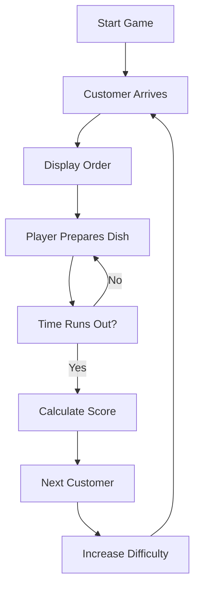

# Game Design Specification

## Overview
The Cooking Game is an endless, procedurally generated cooking simulation that combines speed, accuracy, and strategic decision-making in a cartoon-style environment.

## Core Gameplay Mechanics

### Game Loop


### Customer Order System
- **Dynamic Generation**: Orders created procedurally with increasing complexity
- **Order Types**:
  - Simple: Single ingredient dishes
  - Complex: Multi-ingredient recipes
  - Special: Time-sensitive or bonus dishes
- **Order Components**:
  - Main ingredient
  - Cooking method (grill, fry, bake)
  - Preparation time
  - Special requirements (temperature, presentation)

### Preparation Mechanics
- **Ingredient Selection**: Drag-and-drop interface
- **Cooking Stations**: Multiple stations for different cooking methods
- **Timing**: Real-time cooking with over/under cooking penalties
- **Multi-tasking**: Handle multiple orders simultaneously

## Scoring System

### Base Scoring
- **Speed Bonus**: Points based on completion time vs. target time
- **Accuracy Bonus**: Perfect preparation = full points
- **Presentation Bonus**: Visual appeal affects score

### Advanced Scoring
- **Combo System**: Consecutive perfect orders increase multiplier
- **Skill Multipliers**:
  - Speed: Fast completion bonus
  - Efficiency: Minimal waste bonus
  - Creativity: Unique preparation methods
- **Penalty System**:
  - Late orders: Score reduction
  - Incorrect dishes: Partial credit
  - Customer dissatisfaction: Reputation loss

### Score Calculation Formula
```
Final Score = Base Points × Speed Multiplier × Accuracy Multiplier × Combo Multiplier
```

## Difficulty Scaling

### Progressive Difficulty
- **Level 1-5**: Basic orders, generous time limits
- **Level 6-10**: Multi-ingredient dishes, moderate time pressure
- **Level 11-20**: Complex recipes, tight deadlines
- **Level 21+**: Expert mode with special challenges

### Dynamic Adjustments
- **Player Performance**: Difficulty scales based on success rate
- **Time Pressure**: Orders arrive faster as game progresses
- **Complexity Increase**: More ingredients and cooking steps
- **Unexpected Events**: Random challenges (rush hour, ingredient shortage)

## Customer Interaction Logic

### Customer Types
- **Regular**: Standard orders and patience
- **VIP**: High-value orders, lower patience
- **Difficult**: Complex orders, strict requirements
- **Special**: Bonus opportunities with high rewards

### Satisfaction System
- **Patience Meter**: Visual indicator of customer mood
- **Feedback System**: Immediate response to order quality
- **Reputation Impact**: Long-term effects on customer types
- **Loyalty Program**: Repeat customers with special perks

## Progression System

### Player Progression
- **Experience Points**: Earned through successful orders
- **Skill Unlocks**: New cooking techniques and stations
- **Achievement System**: Milestones and challenges
- **Leaderboard**: Global and local high scores

### Game Progression
- **Endless Mode**: Infinite levels with increasing difficulty
- **Challenge Mode**: Time-limited special events
- **Daily Challenges**: Unique objectives with rewards
- **Seasonal Events**: Limited-time content

## Visual and Audio Design

### Cartoon Aesthetic
- **Character Design**: Exaggerated features, vibrant colors
- **Animation Style**: Smooth, bouncy movements
- **UI Elements**: Rounded corners, playful fonts
- **Color Palette**: Warm, energetic colors (oranges, yellows, reds)

### Audio Feedback
- **Sound Effects**: Cooking sounds, customer reactions
- **Background Music**: Upbeat, energetic tracks
- **Voice Acting**: Cartoon-style customer voices
- **Audio Cues**: Timer warnings, combo celebrations

## Performance Optimization

### Rendering Optimization
- **Sprite Sheets**: Efficient texture management
- **Object Pooling**: Reuse of game objects
- **LOD System**: Level of detail for distant elements
- **Frame Rate Management**: Consistent 60 FPS target

### Memory Management
- **Asset Streaming**: Load assets as needed
- **Garbage Collection**: Minimize memory leaks
- **Cache System**: Frequently used assets in memory
- **Cleanup Routines**: Remove unused objects

## Monetization Strategy (Future)

### Free-to-Play Model
- **Base Game**: Core endless mode free
- **Premium Features**: Cosmetic unlocks, bonus modes
- **In-App Purchases**: Special ingredients, power-ups
- **Ad Integration**: Non-intrusive reward-based ads

## Accessibility Features
- **Color Blind Support**: Alternative color schemes
- **Audio Descriptions**: Screen reader compatibility
- **Customizable Controls**: Keyboard, mouse, touch support
- **Difficulty Options**: Adjustable time limits and complexity

## Analytics and Balancing
- **Player Metrics**: Track engagement and difficulty balance
- **A/B Testing**: Test new features and mechanics
- **Heat Maps**: Identify popular and problematic areas
- **Balance Adjustments**: Data-driven difficulty tuning